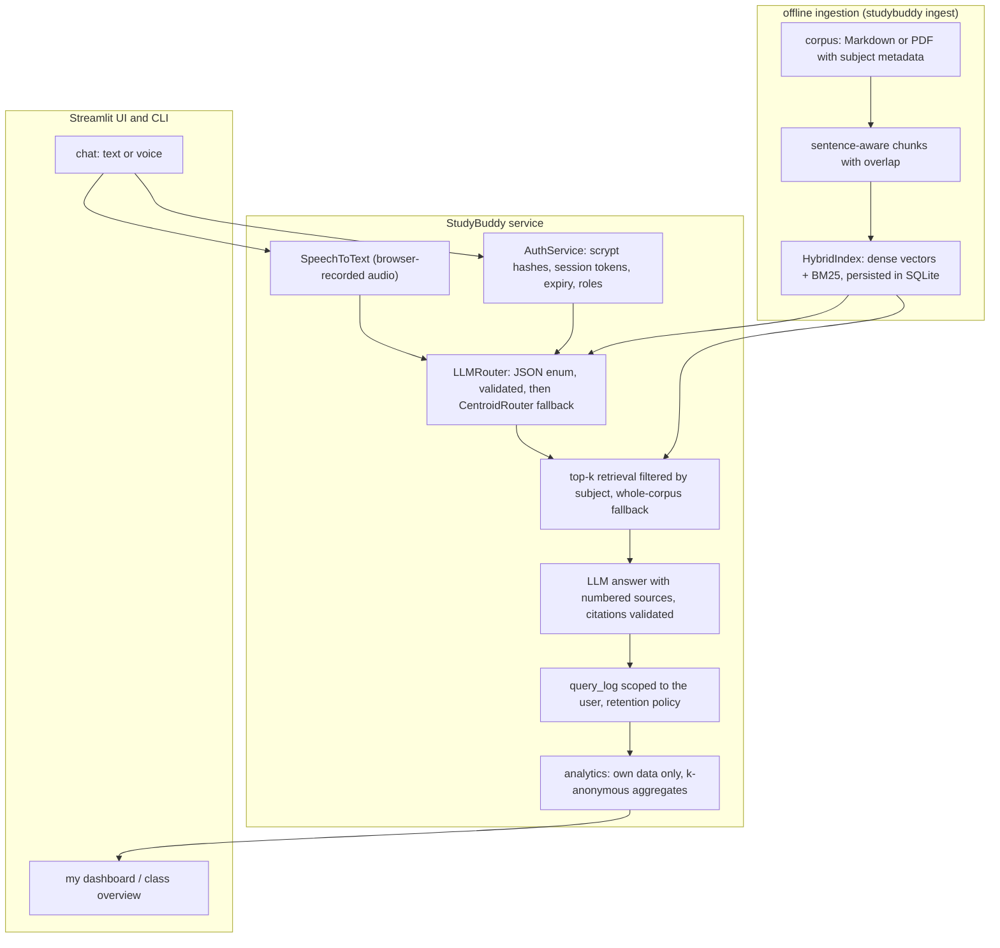

# studybuddy-rag

A voice-enabled study tutor that routes each question to a subject with a strict classifier, answers from the study material with numbered citations, and keeps every student's history and dashboard private to them.

[](https://github.com/KrishnaAnnavaram/studybuddy-rag/actions/workflows/ci.yml)

## Features

- **Strict subject routing.** A dedicated classification call returns JSON over a closed label set (`arts`, `mathematics`, `science`, `general`). Replies are validated, and anything else (prose, unknown labels, missing fields, out-of-range confidence) is rejected. A rejected reply falls back to an embedding nearest-centroid classifier, so retrieval never silently stops.
- **Real retrieval.** Section-aware, sentence-aligned chunks with overlap. The splitter doesn't break `3.14`, `e.g.` or `Dr.`. Hybrid search (dense cosine + BM25) returns the top-k chunks, and the index is persisted in SQLite and built once.
- **Answers with citations.** Sources are numbered in the prompt, and `[n]` citations are checked against them. Citations to sources that don't exist are removed. An answer with no valid citation is labelled *not grounded in the study material*.
- **Secure accounts.** Salted scrypt password hashes, opaque session tokens (only their SHA-256 is stored) with expiry and logout, a session guard on every call, and `student` / `instructor` roles.
- **Privacy by design.** Students see only their own grades and questions. Course averages appear only when at least *k* students contribute, and the instructor view shows aggregates only, with small groups suppressed. Query logs have a retention policy (`studybuddy purge-logs`).
- **Optional voice input.** The question is recorded in the browser (`st.audio_input`) and transcribed by a `SpeechToText` provider, so voice works in a deployed app.
- **Pluggable providers.** Gemini, any OpenAI-compatible endpoint (OpenAI, Ollama, vLLM) and sentence-transformers are selected by environment variables. Deterministic fakes run everything offline.
- **Evaluation harness.** Router accuracy and confusion matrix, retrieval recall@k and MRR, and the rate of answers with a valid citation, all on a labelled question set.

## Architecture



## Quickstart

```bash
python -m venv .venv && . .venv/Scripts/activate     # Windows; use .venv/bin/activate on Linux/macOS
pip install -e ".[dev,ui]"                          # core is pure stdlib; ui adds Streamlit
cp .env.example .env                                # optional: leave values empty for offline demo mode
studybuddy init                                     # demo DB, synthetic users, retrieval index
studybuddy ask -u student_a "How do I add 1/3 and 1/4?"
studybuddy eval                                     # router accuracy, recall@k, citation rate
studybuddy ui                                       # Streamlit app
```

`studybuddy init` creates the synthetic accounts `student_a` to `student_d` and `instructor_demo`. Their password comes from `STUDYBUDDY_DEMO_PASSWORD` or `--password`, or it's generated randomly and printed once. No password is stored in the repository.

To use real models, set e.g. `STUDYBUDDY_LLM_PROVIDER=gemini` and `GEMINI_API_KEY`, and optionally `STUDYBUDDY_EMBEDDING_PROVIDER=sentence-transformers` (`pip install -e ".[embeddings]"`). Then rebuild the index with `studybuddy ingest`, because the index records which embedder built it and refuses to load with a different one.

## Configuration

| Variable | Default | Purpose |
|---|---|---|
| `STUDYBUDDY_DB_PATH` | `data/studybuddy.db` | SQLite file for users, sessions, grades, query log and index |
| `STUDYBUDDY_CORPUS_DIR` | bundled sample corpus | Folder of `.md` documents with a `subject:` header |
| `STUDYBUDDY_LLM_PROVIDER` | `fake` | `fake`, `gemini` or `openai` (any OpenAI-compatible server) |
| `STUDYBUDDY_LLM_MODEL` | `gemini-2.5-flash` / `gpt-4o-mini` | Model id, never hard-coded |
| `STUDYBUDDY_LLM_BASE_URL` | provider default | e.g. `http://localhost:11434/v1` for Ollama |
| `STUDYBUDDY_EMBEDDING_PROVIDER` | `hashing` | `hashing` (offline) or `sentence-transformers` |
| `STUDYBUDDY_EMBEDDING_MODEL` | `all-MiniLM-L6-v2` | sentence-transformers model, loaded once per process |
| `STUDYBUDDY_SPEECH_PROVIDER` | `none` | `none` (mic hidden), `fake` or `openai` (Whisper-compatible) |
| `STUDYBUDDY_SPEECH_MODEL` | `whisper-1` | Transcription model id |
| `STUDYBUDDY_TOP_K` | `4` | Chunks retrieved per question |
| `STUDYBUDDY_MIN_SCORE` | `0.05` | Minimum hybrid score for a chunk to count |
| `STUDYBUDDY_SESSION_TTL_MINUTES` | `60` | Session lifetime |
| `STUDYBUDDY_LOG_RETENTION_DAYS` | `180` | Query-log retention used by `purge-logs` |
| `STUDYBUDDY_K_ANONYMITY` | `3` | Minimum group size for any shown aggregate |
| `STUDYBUDDY_DEMO_PASSWORD` | random | Password for the synthetic demo accounts |
| `GEMINI_API_KEY` | - | Needed for `STUDYBUDDY_LLM_PROVIDER=gemini` |
| `OPENAI_API_KEY` | - | Needed for the hosted OpenAI endpoint (LLM or speech) |

## Project structure

```
src/studybuddy_rag/
  config.py          Settings from environment variables, tiny .env loader
  subjects.py        the closed subject label set and its strict parser
  text.py            tokenisation, stemming, decimal/abbreviation-safe sentence splitting
  ingest.py          Markdown/PDF parsing and section-aware chunking with overlap
  index.py           HybridIndex: dense + BM25, subject filter, SQLite persistence
  router.py          LLMRouter (JSON schema + validation) and CentroidRouter fallback
  tutor.py           greeting check -> route -> retrieve -> answer -> validate citations
  auth.py            scrypt hashing, sessions with expiry, roles
  db.py              SQLite schema and row access
  analytics.py       student dashboard, instructor aggregates, summary, retention
  service.py         StudyBuddy facade used by the UI and CLI (every call takes a token)
  evaluate.py        router accuracy, recall@k, MRR, citation rate
  seed.py            synthetic demo users and grades
  cli.py             `studybuddy` command
  providers/         LLM, embedding and speech interfaces, adapters and offline fakes
  app/streamlit_app.py  login, chat (text/voice), my dashboard, class overview
  data/corpus/       small original sample corpus (CC BY 4.0)
  data/eval_set.jsonl  labelled questions for the evaluation harness
tests/               pytest suite (no network, no API keys)
```

## How it works

1. **Ingest.** Each document carries `title` and `subject` metadata. Sections are split into sentences, and the sentences are packed into chunks of about 120 words with a one-sentence overlap that never crosses a section. Chunks are embedded once and stored in SQLite along with the embedder's name.
2. **Route.** The question goes to a classification-only prompt with a JSON schema whose `subject` is an enum. `parse_route_output` accepts only `{"subject": <label>, "confidence": 0..1}`. After a retry, an invalid reply falls back to the nearest subject centroid of the corpus embeddings.
3. **Retrieve.** The top-k chunks are searched within the routed subject. If none clears the threshold, the whole corpus is searched, because routing narrows retrieval and never disables it. `general` questions still get a stricter corpus search.
4. **Answer.** The LLM sees numbered sources and must cite them as `[n]`. Out-of-range citations are stripped. An answer without a valid citation is marked ungrounded, and the UI says so.
5. **Log and analyse.** The question, subject, route method, answer and cited sources are logged against the authenticated user. Dashboards read only that user's rows. Shared numbers (course averages, instructor charts) are aggregates with groups smaller than *k* suppressed.

On the bundled evaluation set (23 questions, offline fakes) the router scores 0.96 accuracy with the fake LLM (0.87 with the centroid classifier alone), with recall@4 of 1.00, MRR of 1.00, and a valid citation on 100% of answers. These numbers only show that the pipeline is wired correctly, not real-world quality.

## Testing

```bash
pytest -q
```

The 54 tests cover the router's strict parsing and fallback, the decimal-safe splitter and chunk overlap, top-k subject-filtered retrieval and index persistence, citation validation and ungrounded answers, password hashing, session expiry and logout, per-student data isolation, the correct "you" on the dashboard, k-anonymous aggregates, the single summary function, retention, the voice path, configuration and the CLI. They all use the deterministic fakes and need no network or keys.

## Roadmap

- [x] **M1:** auth with hashed passwords, sessions, roles, SQLite schema and privacy-scoped analytics
- [x] **M2:** ingestion (Markdown, optional PDF), chunking and a persistent hybrid index
- [x] **M3:** strict router, RAG with validated citations, and an evaluation harness
- [x] **M4:** Streamlit chat (text and browser voice) plus student and instructor dashboards
- [ ] **M5:** cross-encoder reranking and answer-faithfulness scoring (LLM-as-judge)
- [ ] **M6:** FastAPI backend with JWT, Alembic migrations and argon2 hashes
- [ ] **M7:** ingest a full open-licensed textbook set (e.g. OpenStax) with page-level citations

## Limitations

- The bundled corpus is a tiny sample written for this demo. It is not a curriculum. Use open-licensed books for real use.
- The offline `hashing` embedder is lexical. Use `sentence-transformers` for semantic matching.
- The fake LLM is extractive and exists for tests and demos. Answer quality depends on the configured model.
- Citation checks verify that a cited source exists, not that the claim is entailed by it.
- SQLite and Streamlit suit a single-server demo. Multi-user production needs the M6 backend.

## License

MIT © 2026 Krishna Annavaram. See [LICENSE](LICENSE).
