<div align="center">

# studybuddy-rag — Subject-Routed Study Tutor With Cited Answers

**studybuddy-rag is a study tutor for school students that gives answers from the study material with numbered citations. It takes a text or voice question through these steps to a cited answer:**

`authenticate` → `route` → `retrieve` → `answer` → `check citations` → `record`.


**[Summary](#1-summary)** ·
**[Workflow](#4-the-end-to-end-workflow)** ·
**[Run it](#16-how-to-run-studybuddy-rag)** ·
**[Configuration](#164-environment-variables)** ·
**[Known problems](#19-known-problems)** ·
**[Glossary](#21-glossary)**

</div>

> [!NOTE]
> This README uses ASD-STE100 Simplified Technical English. The writing rules and the project
> vocabulary are in [`docs/ste-style-guide.md`](docs/ste-style-guide.md). Each term in the
> [Glossary](#21-glossary) has only one meaning.

---

studybuddy-rag is a retrieval-augmented tutor for arts, mathematics and science.
A strict classifier routes each question to one subject, and a hybrid index retrieves the top chunks of the study material.
The answer cites its sources as `[n]`, and the code removes each citation that points to no source.
Each student sees only the data of that student.
The core uses only the Python standard library, so the full demo runs offline with deterministic fakes.

This README is the **one location that explains all of studybuddy-rag**. It gives these topics:

- the general design
- each component and its procedure, step by step
- the decision rules
- the data map
- the runbook
- the validation results and the known problems

| If you are… | Read |
|---|---|
| A manager or reviewer | [1](#1-summary), [3](#3-design-rules), [4](#4-the-end-to-end-workflow), [18](#18-validation-results), [20](#20-key-points) |
| A developer who joins the project | All sections, in sequence. Keep [16](#16-how-to-run-studybuddy-rag) and [19](#19-known-problems) open while you work |
| An operator who runs studybuddy-rag | [16](#16-how-to-run-studybuddy-rag), then the section for the component that you use |

---

## Table of contents

1. 🧭 [Summary](#1-summary)
2. 🏗️ [How studybuddy-rag is built](#2-how-studybuddy-rag-is-built)
   - 2.1 [Components](#21-components)
   - 2.2 [System context](#22-system-context)
   - 2.3 [Repository layout](#23-repository-layout)
3. 🛡️ [Design rules](#3-design-rules)
4. 🔄 [The end-to-end workflow](#4-the-end-to-end-workflow)
   - 4.1 [Full flow](#41-full-flow)
   - 4.2 [The life cycle of one question](#42-the-life-cycle-of-one-question)
   - 4.3 [Who does which step](#43-who-does-which-step)
5. 🔵 [Ingestion and chunks](#5-ingestion-and-chunks)
6. 🟢 [The hybrid index](#6-the-hybrid-index)
7. 🟣 [The subject router](#7-the-subject-router)
8. 🟠 [The tutor and the citation check](#8-the-tutor-and-the-citation-check)
9. 🔐 [Accounts and sessions](#9-accounts-and-sessions)
10. 📊 [Progress analytics](#10-progress-analytics)
11. 🎙️ [Providers and voice input](#11-providers-and-voice-input)
12. 🖥️ [Service, CLI and user interface](#12-service-cli-and-user-interface)
13. 🧪 [The evaluation harness](#13-the-evaluation-harness)
14. ⚖️ [The safety and privacy model](#14-the-safety-and-privacy-model)
15. 🗂️ [Data and file map](#15-data-and-file-map)
16. ▶️ [How to run studybuddy-rag](#16-how-to-run-studybuddy-rag)
    - 16.1 [Prerequisites](#161-prerequisites) · 16.2 [Installation](#162-installation) · 16.3 [Run studybuddy-rag](#163-run-studybuddy-rag) · 16.4 [Environment variables](#164-environment-variables)
17. 🧩 [How to extend studybuddy-rag](#17-how-to-extend-studybuddy-rag)
18. ✅ [Validation results](#18-validation-results)
19. ⚠️ [Known problems](#19-known-problems)
20. 📌 [Key points](#20-key-points)
21. 📖 [Glossary](#21-glossary)
22. 📄 [License](#22-license)

---

## 1. Summary

**The problem.** A student asks a question in free text or by voice, and the tutor must give an answer from the study material. These questions are difficult:

- Which subject does the question belong to, and what happens when the classifier gives a bad reply?
- Which parts of the study material contain the answer?
- How does the student know that the answer comes from the study material?
- How does the tutor keep the grades and the questions of one student away from other students?

studybuddy-rag gives each of these questions its own component. The service connects the components, and each call starts with a session check.

| Item | Value |
|---|---|
| Input | A question as text, or as audio that the browser records |
| Output | An answer with numbered citations, the route decision and notes. A dashboard for each student |
| Components | **16** modules: settings, subjects, text tools, ingestion, index, router, tutor, auth, database, analytics, seed, service, evaluation, CLI, Streamlit UI, providers |
| Subjects | `arts`, `mathematics`, `science` (with study material) and `general` (no study material) |
| Providers | LLM: Gemini or any OpenAI-compatible server. Embedder: `sentence-transformers`. Speech: OpenAI Whisper. All optional |
| Offline mode | `FakeLLM`, the `hashing` embedder and `FakeSpeechToText`. No key and no network |
| Safety | Scrypt password hashes, a session check on each call, data for each student only, k-anonymous aggregates |
| Tests | **55** unit tests (`pytest`) |

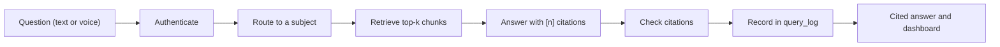
```mermaid
flowchart LR
    IN["Question (text or voice)"] --> A["Authenticate"] --> B["Route to a subject"] --> C["Retrieve top-k chunks"] --> D["Answer with [n] citations"] --> E["Check citations"] --> F["Record in query_log"] --> OUT["Cited answer and dashboard"]
```

---

## 2. How studybuddy-rag is built

### 2.1 Components

| Component | Module | Purpose |
|---|---|---|
| Settings | `src/studybuddy_rag/config.py` | Read and validate the environment variables. Load a local `.env` file |
| Subjects | `src/studybuddy_rag/subjects.py` | The closed label set and its strict parser |
| Text tools | `src/studybuddy_rag/text.py` | Tokens, stems, stop words and a sentence splitter that keeps `3.14` and `e.g.` |
| Ingestion | `src/studybuddy_rag/ingest.py` | Parse Markdown documents and pack sentences into chunks |
| Hybrid index | `src/studybuddy_rag/index.py` | Dense cosine plus BM25 search, subject filter, SQLite persistence |
| Subject router | `src/studybuddy_rag/router.py` | `LLMRouter` with a JSON schema, then the `CentroidRouter` fallback |
| Tutor | `src/studybuddy_rag/tutor.py` | Greeting check, route, retrieve, answer, citation check |
| Auth service | `src/studybuddy_rag/auth.py` | Scrypt hashes, session tokens with expiry, roles |
| Database | `src/studybuddy_rag/db.py` | SQLite schema and row access |
| Analytics | `src/studybuddy_rag/analytics.py` | Student dashboard, instructor overview, grade summary, retention |
| Seed | `src/studybuddy_rag/seed.py` | Synthetic demo users, courses and grades |
| Service | `src/studybuddy_rag/service.py` | The `StudyBuddy` facade. Each call takes a session token |
| Evaluation | `src/studybuddy_rag/evaluate.py` | Router accuracy, recall@k, MRR and citation rate |
| CLI | `src/studybuddy_rag/cli.py` | The `studybuddy` command with 6 subcommands |
| Streamlit UI | `src/studybuddy_rag/app/streamlit_app.py` | Login, chat, dashboard and class overview pages |
| Providers | `src/studybuddy_rag/providers/` | LLM, embedder and speech interfaces, HTTP adapters and offline fakes |

The component map shows which module calls which module. An arrow points from the caller to the module that it uses.

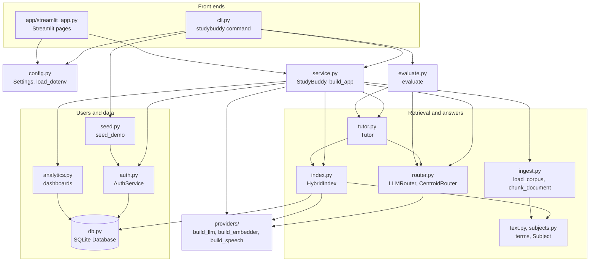
```mermaid
flowchart TB
    subgraph FRONT["Front ends"]
        CLI["cli.py<br/>studybuddy command"]
        UI["app/streamlit_app.py<br/>Streamlit pages"]
    end
    CFG["config.py<br/>Settings, load_dotenv"]
    SVC["service.py<br/>StudyBuddy, build_app"]
    subgraph RAG["Retrieval and answers"]
        ING["ingest.py<br/>load_corpus, chunk_document"]
        IDX["index.py<br/>HybridIndex"]
        RT["router.py<br/>LLMRouter, CentroidRouter"]
        TU["tutor.py<br/>Tutor"]
        TXT["text.py, subjects.py<br/>terms, Subject"]
    end
    subgraph USERS["Users and data"]
        AU["auth.py<br/>AuthService"]
        AN["analytics.py<br/>dashboards"]
        SD["seed.py<br/>seed_demo"]
        DB[("db.py<br/>SQLite Database")]
    end
    PRV["providers/<br/>build_llm, build_embedder, build_speech"]
    EV["evaluate.py<br/>evaluate"]
    CLI --> CFG
    UI --> CFG
    CLI --> SVC
    UI --> SVC
    CLI --> SD
    CLI --> EV
    SVC --> ING
    SVC --> IDX
    SVC --> RT
    SVC --> TU
    SVC --> AU
    SVC --> AN
    SVC --> PRV
    TU --> IDX
    TU --> RT
    RT --> PRV
    IDX --> PRV
    IDX --> TXT
    ING --> TXT
    AU --> DB
    AN --> DB
    SD --> AU
    IDX --> DB
    EV --> RT
    EV --> TU
```

### 2.2 System context

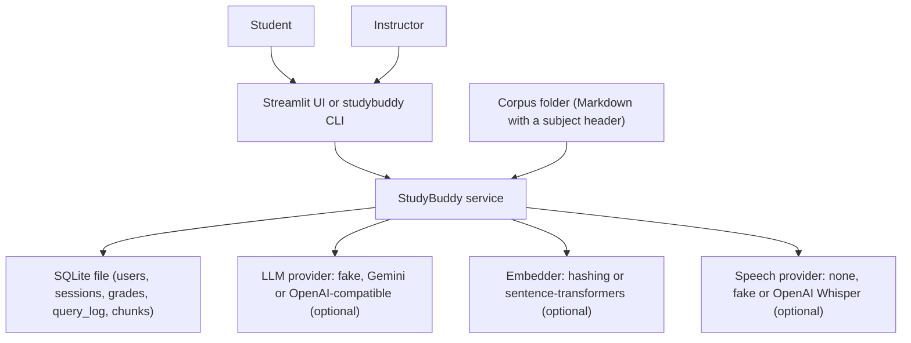
```mermaid
flowchart TB
    S["Student"] --> UI["Streamlit UI or studybuddy CLI"]
    T["Instructor"] --> UI
    UI --> SVC["StudyBuddy service"]
    SVC --> DB["SQLite file (users, sessions, grades, query_log, chunks)"]
    SVC --> LLM["LLM provider: fake, Gemini or OpenAI-compatible (optional)"]
    SVC --> EMB["Embedder: hashing or sentence-transformers (optional)"]
    SVC --> STT["Speech provider: none, fake or OpenAI Whisper (optional)"]
    CORP["Corpus folder (Markdown with a subject header)"] --> SVC
```

### 2.3 Repository layout

```
studybuddy-rag/
├── .github/workflows/ci.yml     # CI: Python 3.11, pip install -e ".[dev]", pytest -q
├── .env.example                 # every environment variable, all values empty
├── pyproject.toml               # package, extras (ui, embeddings, pdf, dev, all), studybuddy script
├── src/studybuddy_rag/
│   ├── config.py  subjects.py  text.py     # settings, label set, text tools
│   ├── ingest.py  index.py                 # chunks and the hybrid index
│   ├── router.py  tutor.py                 # routing and cited answers
│   ├── auth.py  db.py  seed.py             # accounts, sessions, schema, demo data
│   ├── analytics.py  service.py            # dashboards and the facade
│   ├── evaluate.py  cli.py                 # evaluation harness and command line
│   ├── app/streamlit_app.py                # user interface
│   ├── providers/                          # base, factory, fakes, http, llm, embeddings, speech
│   └── data/
│       ├── corpus/*.md                     # 5 sample documents (CC BY 4.0), 22 chunks
│       └── eval_set.jsonl                  # 23 labelled questions
└── tests/                                  # 55 tests, no network, no API keys
```

---

## 3. Design rules

### 3.1 The router narrows retrieval and never disables it
The tutor first searches the routed subject. If no chunk is above `STUDYBUDDY_MIN_SCORE`, the tutor searches all subjects and adds a note. A `general` question also gets a corpus search, with the stricter threshold `0.25`. This logic is in `Tutor.retrieve` in `tutor.py`.

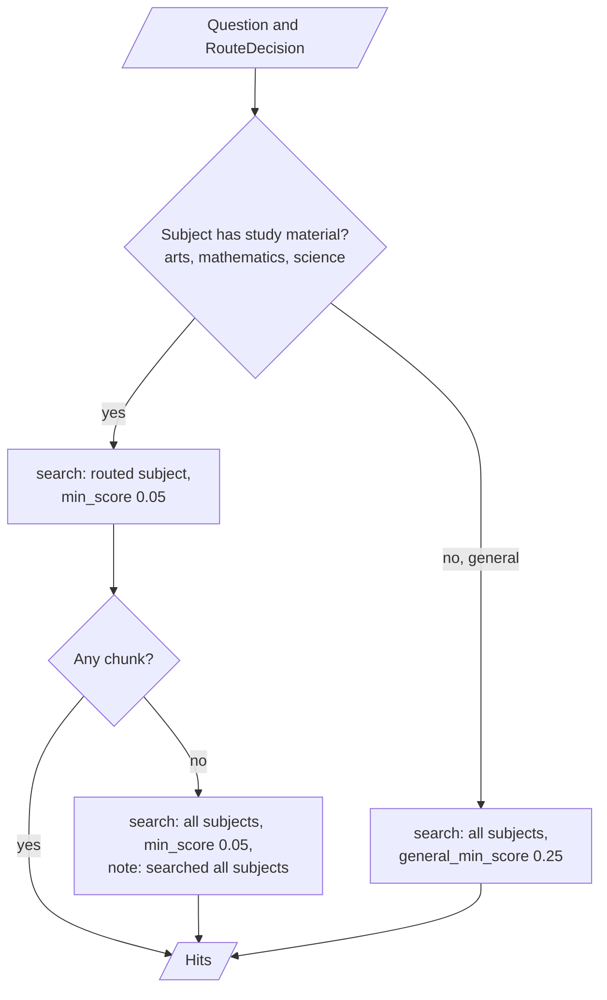
```mermaid
flowchart TD
    Q[/"Question and RouteDecision"/] --> HAS{"Subject has study material?<br/>arts, mathematics, science"}
    HAS -- "yes" --> S1["search: routed subject,<br/>min_score 0.05"]
    S1 --> ANY{"Any chunk?"}
    ANY -- "yes" --> OUT[/"Hits"/]
    ANY -- "no" --> S2["search: all subjects, min_score 0.05,<br/>note: searched all subjects"]
    S2 --> OUT
    HAS -- "no, general" --> S3["search: all subjects,<br/>general_min_score 0.25"]
    S3 --> OUT
```

### 3.2 The classifier reply is strict
`LLMRouter` makes a dedicated classification call with `ROUTER_SCHEMA`. The `subject` field is an enum of the four labels. `parse_route_output` rejects prose, unknown labels, absent fields, extra fields and a confidence outside 0 to 1. After a rejected reply, the router tries one more time and then uses `CentroidRouter`.

### 3.3 Each claim cites a source that exists
The answer prompt numbers the sources `[1]` to `[k]`. `extract_citations` splits the citations into valid and invalid numbers. The tutor removes each invalid citation from the text. An answer with no valid citation has the kind `ungrounded`, and the CLI and the UI tell the student.

### 3.4 Each call has a session token
`StudyBuddy` is the only entry point for the CLI and the UI. Each method calls `AuthService.authenticate(token)` before it does work. `ask_voice` checks the session before it sends audio to the speech provider.

### 3.5 Each student sees only the data of that student
The analytics functions read rows only for `principal.user_id`. The `_grades_for_user` and `_queries_for_user` helpers in `db.py` take the user ID from the authenticated principal, not from the request. The optional LLM summary gets only the grades of the caller.

### 3.6 Shared numbers are k-anonymous
A course average is visible only when at least `STUDYBUDDY_K_ANONYMITY` students have a grade in that course. The instructor view hides each course with fewer than k grades. It also hides each subject that fewer than k students asked about.

### 3.7 The default mode is offline
Each provider has a deterministic fake. With no environment variables, the app, the CLI and the tests use `FakeLLM` and the `hashing` embedder. The core package has no third-party dependencies.

### 3.8 No secret is in the repository
`Settings` hides the API keys from `repr`. Demo passwords come from `--password`, `STUDYBUDDY_DEMO_PASSWORD` or a random value that `init` prints one time. Git ignores `.env`, `*.db` and `/data/`.

---

## 4. The end-to-end workflow

### 4.1 Full flow

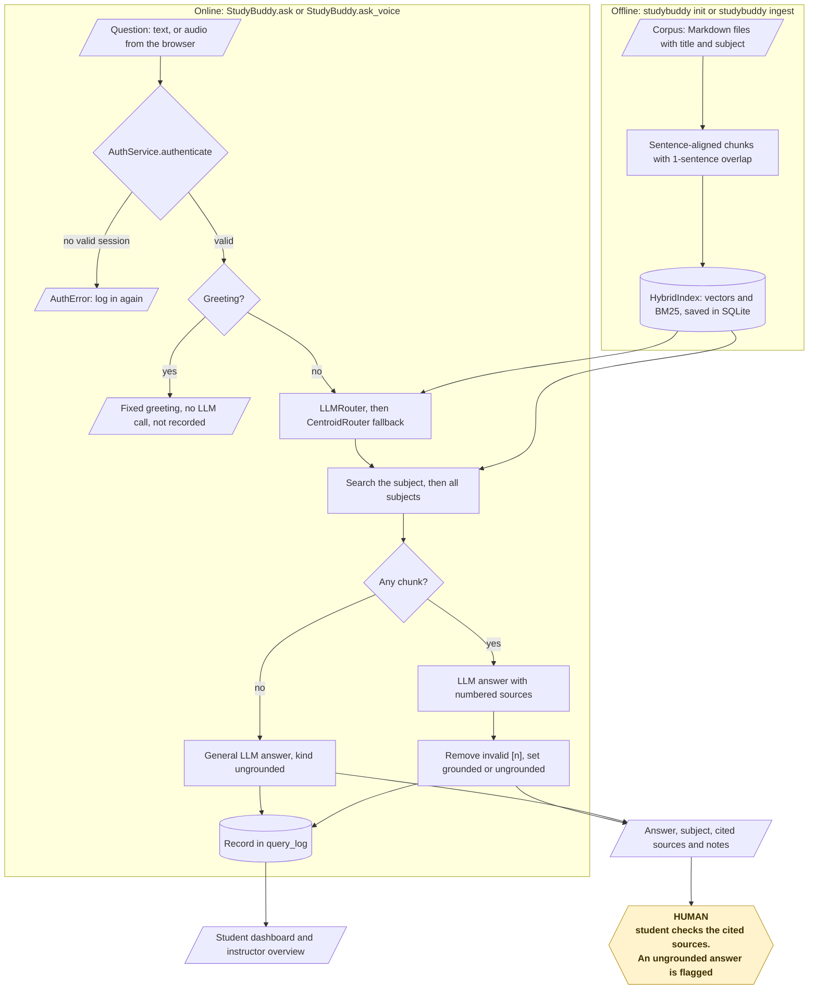
```mermaid
flowchart TD
    subgraph OFF["Offline: studybuddy init or studybuddy ingest"]
        MD[/"Corpus: Markdown files with title and subject"/] --> CH["Sentence-aligned chunks with 1-sentence overlap"]
        CH --> IDX[("HybridIndex: vectors and BM25, saved in SQLite")]
    end
    subgraph ON["Online: StudyBuddy.ask or StudyBuddy.ask_voice"]
        QIN[/"Question: text, or audio from the browser"/] --> AUTH{"AuthService.authenticate"}
        AUTH -- "no valid session" --> DENY[/"AuthError: log in again"/]
        AUTH -- "valid" --> GREET{"Greeting?"}
        GREET -- "yes" --> HELLO[/"Fixed greeting, no LLM call, not recorded"/]
        GREET -- "no" --> ROUTE["LLMRouter, then CentroidRouter fallback"]
        ROUTE --> RET["Search the subject, then all subjects"]
        RET --> HITS{"Any chunk?"}
        HITS -- "no" --> GEN["General LLM answer, kind ungrounded"]
        HITS -- "yes" --> ANS["LLM answer with numbered sources"]
        ANS --> CHK["Remove invalid [n], set grounded or ungrounded"]
        GEN --> LOG[("Record in query_log")]
        CHK --> LOG
    end
    IDX --> RET
    IDX --> ROUTE
    CHK --> SHOW[/"Answer, subject, cited sources and notes"/]
    GEN --> SHOW
    SHOW --> HUMAN{{"HUMAN<br/>student checks the cited sources.<br/>An ungrounded answer is flagged"}}
    LOG --> DASH[/"Student dashboard and instructor overview"/]

    classDef human fill:#fff3cd,stroke:#b8901f,color:#3d2f00,font-weight:bold
    class HUMAN human
```

### 4.2 The life cycle of one question

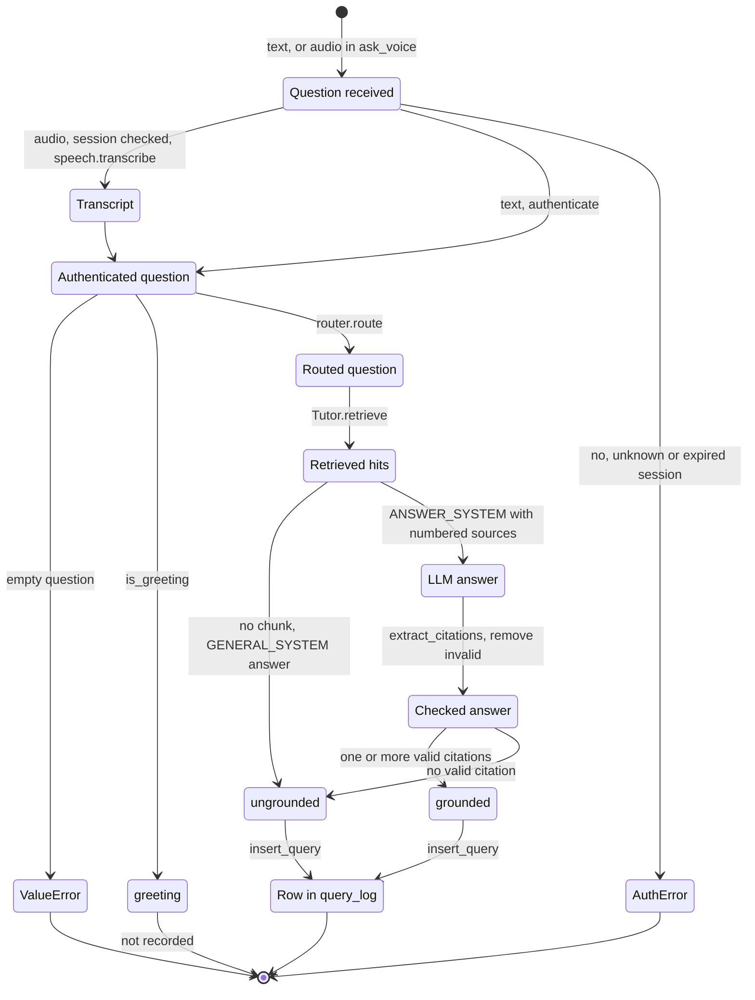
```mermaid
stateDiagram-v2
    state "Question received" as Received
    state "Transcript" as Transcript
    state "Authenticated question" as Authed
    state "Routed question" as Routed
    state "Retrieved hits" as Hits
    state "LLM answer" as Draft
    state "Checked answer" as Checked
    state "Row in query_log" as Logged
    [*] --> Received: text, or audio in ask_voice
    Received --> Transcript: audio, session checked, speech.transcribe
    Transcript --> Authed
    Received --> Authed: text, authenticate
    Received --> AuthError: no, unknown or expired session
    Authed --> ValueError: empty question
    Authed --> greeting: is_greeting
    Authed --> Routed: router.route
    Routed --> Hits: Tutor.retrieve
    Hits --> ungrounded: no chunk, GENERAL_SYSTEM answer
    Hits --> Draft: ANSWER_SYSTEM with numbered sources
    Draft --> Checked: extract_citations, remove invalid
    Checked --> grounded: one or more valid citations
    Checked --> ungrounded: no valid citation
    grounded --> Logged: insert_query
    ungrounded --> Logged: insert_query
    greeting --> [*]: not recorded
    Logged --> [*]
    AuthError --> [*]
    ValueError --> [*]
```

1. The student sends a question in the UI, or with `studybuddy ask`.
2. If the question is audio, the service authenticates the session and transcribes the audio.
3. The service authenticates the session token.
4. The tutor normalises the white space. An empty question causes a `ValueError`.
5. If the question is a greeting, the tutor returns a fixed greeting and stops here.
6. The router gives a route decision: a subject, a confidence and a method.
7. The tutor retrieves up to `STUDYBUDDY_TOP_K` chunks.
8. If no chunk is found, the LLM gives a general answer with the kind `ungrounded`.
9. Otherwise, the LLM gets the numbered sources and gives an answer with `[n]` citations.
10. The tutor removes invalid citations and sets the kind to `grounded` or `ungrounded`.
11. The service records the question, the subject, the method, the answer and the citations in `query_log`.
12. The UI or the CLI shows the answer, the subject, the cited sources and the notes.

### 4.3 Who does which step

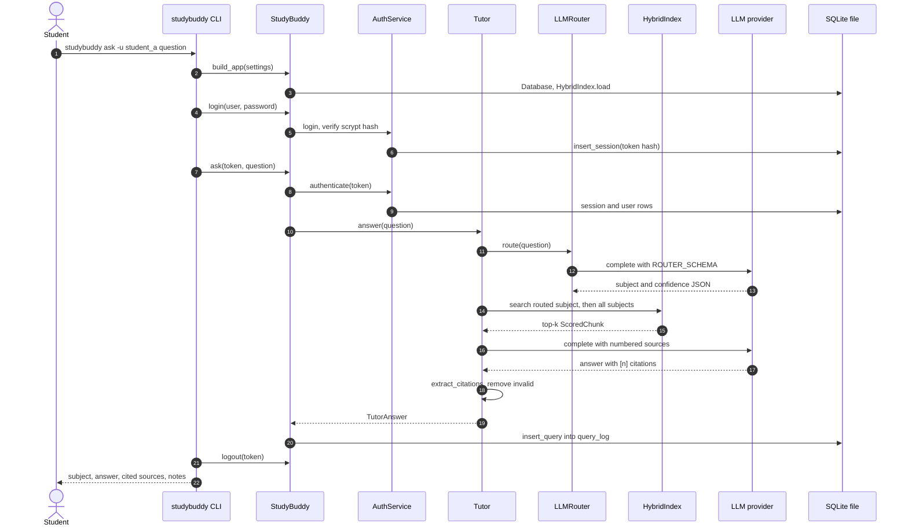
```mermaid
sequenceDiagram
    autonumber
    actor S as Student
    participant CLI as studybuddy CLI
    participant SVC as StudyBuddy
    participant AU as AuthService
    participant TU as Tutor
    participant RT as LLMRouter
    participant IDX as HybridIndex
    participant LLM as LLM provider
    participant DB as SQLite file

    S->>CLI: studybuddy ask -u student_a question
    CLI->>SVC: build_app(settings)
    SVC->>DB: Database, HybridIndex.load
    CLI->>SVC: login(user, password)
    SVC->>AU: login, verify scrypt hash
    AU->>DB: insert_session(token hash)
    CLI->>SVC: ask(token, question)
    SVC->>AU: authenticate(token)
    AU->>DB: session and user rows
    SVC->>TU: answer(question)
    TU->>RT: route(question)
    RT->>LLM: complete with ROUTER_SCHEMA
    LLM-->>RT: subject and confidence JSON
    TU->>IDX: search routed subject, then all subjects
    IDX-->>TU: top-k ScoredChunk
    TU->>LLM: complete with numbered sources
    LLM-->>TU: answer with [n] citations
    TU->>TU: extract_citations, remove invalid
    TU-->>SVC: TutorAnswer
    SVC->>DB: insert_query into query_log
    CLI->>SVC: logout(token)
    CLI-->>S: subject, answer, cited sources, notes
```

---

## 5. Ingestion and chunks

**Purpose.** Change the study material into small, overlapping chunks that keep their title, section and subject.

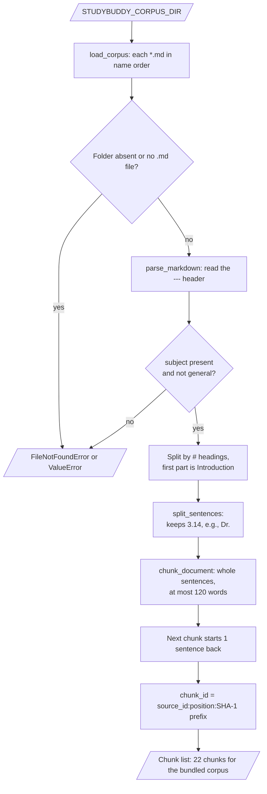
```mermaid
flowchart TD
    DIR[/"STUDYBUDDY_CORPUS_DIR"/] --> LOAD["load_corpus: each *.md in name order"]
    LOAD --> NONE{"Folder absent or no .md file?"}
    NONE -- "yes" --> ERR[/"FileNotFoundError or ValueError"/]
    NONE -- "no" --> HDR["parse_markdown: read the --- header"]
    HDR --> SUBJ{"subject present<br/>and not general?"}
    SUBJ -- "no" --> ERR
    SUBJ -- "yes" --> SEC["Split by # headings,<br/>first part is Introduction"]
    SEC --> SENT["split_sentences:<br/>keeps 3.14, e.g., Dr."]
    SENT --> PACK["chunk_document: whole sentences,<br/>at most 120 words"]
    PACK --> OVL["Next chunk starts 1 sentence back"]
    OVL --> ID["chunk_id = source_id:position:SHA-1 prefix"]
    ID --> OUT[/"Chunk list: 22 chunks for the bundled corpus"/]
```

| Input | Output |
|---|---|
| A folder of `.md` files (`STUDYBUDDY_CORPUS_DIR`). Each file starts with a `---` header with `title`, `subject` and `license` | A list of `Chunk` objects with `chunk_id`, `source_id`, `title`, `subject`, `section`, `text`, `page` and `position` |

**Procedure**

1. `load_corpus` reads each `*.md` file in the folder in name order.
2. `parse_markdown` reads the header. A file without `subject` causes an error.
3. A `subject` of `general` causes an error, because `general` has no study material.
4. Each `#` heading starts a new section. Text before the first heading goes into the section `Introduction`.
5. `split_sentences` splits each section into sentences.
6. `chunk_document` packs whole sentences into chunks of at most 120 words.
7. Two chunks next to each other in a section share one sentence of overlap.
8. Each chunk gets the ID `<source_id>:<position>:<8 hex characters of SHA-1>`.

**Rules**

- A chunk never crosses a section boundary.
- A sentence with more than 120 words becomes one chunk.
- The splitter does not split after a decimal point (`3.14`), after a known abbreviation (`e.g.`, `Dr.`, `Fig.`) or after a single initial.
- `max_words` must be 10 or more. `overlap_sentences` must be 0 or more.
- The bundled corpus has 5 documents (1,319 words) and gives 22 chunks.
- `parse_pdf` reads a PDF page by page with the `pdf` extra. `load_corpus` does not call it. See [Known problems](#19-known-problems).

---

## 6. The hybrid index

**Purpose.** Find the top-k chunks for a question, with an optional subject filter.

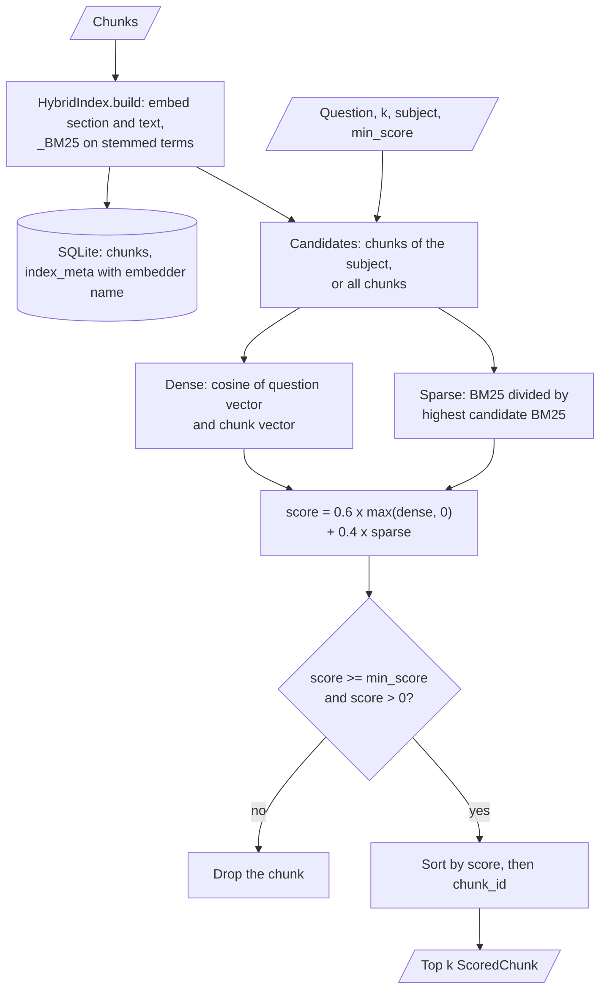
```mermaid
flowchart TD
    CH[/"Chunks"/] --> BUILD["HybridIndex.build: embed section and text,<br/>_BM25 on stemmed terms"]
    BUILD --> SAVE[("SQLite: chunks, index_meta with embedder name")]
    Q[/"Question, k, subject, min_score"/] --> FILT["Candidates: chunks of the subject,<br/>or all chunks"]
    BUILD --> FILT
    FILT --> DEN["Dense: cosine of question vector<br/>and chunk vector"]
    FILT --> SPA["Sparse: BM25 divided by<br/>highest candidate BM25"]
    DEN --> MIX["score = 0.6 x max(dense, 0)<br/>+ 0.4 x sparse"]
    SPA --> MIX
    MIX --> KEEP{"score >= min_score<br/>and score > 0?"}
    KEEP -- "no" --> DROP["Drop the chunk"]
    KEEP -- "yes" --> SORT["Sort by score, then chunk_id"]
    SORT --> OUT[/"Top k ScoredChunk"/]
```

| Input | Output |
|---|---|
| A question, `k`, an optional subject and `min_score` | Up to `k` `ScoredChunk` objects, sorted by score (high to low) |

**Procedure**

1. `HybridIndex.build` embeds the text `"<section>. <text>"` of each chunk one time.
2. The index also builds BM25 statistics (`k1 = 1.5`, `b = 0.75`) on the stemmed content words.
3. `search` keeps only the chunks of the subject, if a subject is given.
4. It calculates the dense score: the cosine of the question vector and the chunk vector.
5. It calculates the sparse score: BM25, divided by the highest BM25 score of the candidates.
6. It calculates `score = 0.6 × max(dense, 0) + 0.4 × sparse`.
7. It keeps each chunk with `score >= min_score` and `score > 0`, and returns the top `k`.
8. `save` writes the tables `chunks` and `index_meta` into the SQLite file, and replaces the old tables.

**Rules**

- `index_meta` records the embedder name, for example `hashing-1024` or `st:all-MiniLM-L6-v2`.
- `HybridIndex.load` refuses an index from a different embedder and tells you to run `studybuddy ingest`.
- Equal scores sort by `chunk_id`, so the result order is deterministic.
- `k` must be 1 or more. `dense_weight` must be between 0 and 1.

---

## 7. The subject router

**Purpose.** Give each question exactly one subject from the closed label set.

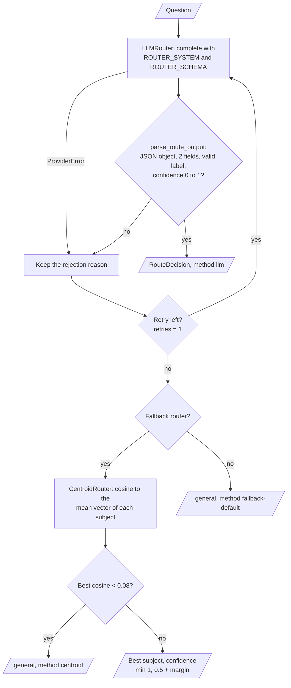
```mermaid
flowchart TD
    Q[/"Question"/] --> CALL["LLMRouter: complete with<br/>ROUTER_SYSTEM and ROUTER_SCHEMA"]
    CALL -- "ProviderError" --> FAIL
    CALL --> PARSE{"parse_route_output:<br/>JSON object, 2 fields, valid label,<br/>confidence 0 to 1?"}
    PARSE -- "yes" --> LLMD[/"RouteDecision, method llm"/]
    PARSE -- "no" --> FAIL["Keep the rejection reason"]
    FAIL --> RETRY{"Retry left?<br/>retries = 1"}
    RETRY -- "yes" --> CALL
    RETRY -- "no" --> FB{"Fallback router?"}
    FB -- "yes" --> CEN["CentroidRouter: cosine to the<br/>mean vector of each subject"]
    CEN --> LOW{"Best cosine < 0.08?"}
    LOW -- "yes" --> GEN[/"general, method centroid"/]
    LOW -- "no" --> BEST[/"Best subject, confidence<br/>min 1, 0.5 + margin"/]
    FB -- "no" --> DEF[/"general, method fallback-default"/]
```

| Input | Output |
|---|---|
| A question | A `RouteDecision`: `subject`, `confidence`, `method` (`llm`, `centroid` or `fallback-default`) and `detail` |

**Procedure**

1. `LLMRouter` sends `Subjects: ...` and `Question: ...` with the system prompt `ROUTER_SYSTEM` and `ROUTER_SCHEMA`.
2. `parse_route_output` removes a code fence, if there is one, and parses the JSON.
3. If the reply is valid, the method is `llm`.
4. If the reply is invalid or the provider fails, the router tries one more time (`retries=1`).
5. After two failures, `CentroidRouter` routes the question. The `detail` field keeps the rejection reasons.
6. If there is no fallback router, the subject is `general` and the method is `fallback-default`.

**Rules**

- `Subject.parse` accepts only an exact label. Case and white space at the ends do not matter.
- The confidence must be a finite number from 0 to 1. A boolean is not a number here.
- `CentroidRouter` uses the mean vector of the chunks of each subject.
- If the best cosine similarity is less than `0.08`, `CentroidRouter` returns `general`.
- The centroid confidence is `min(1, 0.5 + margin)`, where the margin is the difference between the two best similarities.

---

## 8. The tutor and the citation check

**Purpose.** Give an answer from the retrieved chunks and prove each citation against the numbered sources.

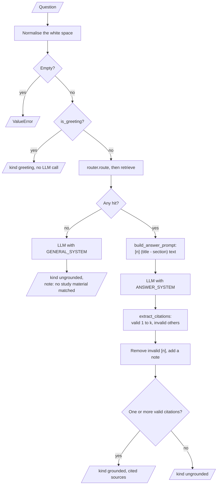
```mermaid
flowchart TD
    Q[/"Question"/] --> NORM["Normalise the white space"]
    NORM --> EMPTY{"Empty?"}
    EMPTY -- "yes" --> VE[/"ValueError"/]
    EMPTY -- "no" --> GR{"is_greeting?"}
    GR -- "yes" --> HELLO[/"kind greeting, no LLM call"/]
    GR -- "no" --> RT["router.route, then retrieve"]
    RT --> HITS{"Any hit?"}
    HITS -- "no" --> GEN["LLM with GENERAL_SYSTEM"]
    GEN --> UNG[/"kind ungrounded,<br/>note: no study material matched"/]
    HITS -- "yes" --> PR["build_answer_prompt:<br/>[n] (title - section) text"]
    PR --> ANS["LLM with ANSWER_SYSTEM"]
    ANS --> EX["extract_citations:<br/>valid 1 to k, invalid others"]
    EX --> RM["Remove invalid [n], add a note"]
    RM --> VAL{"One or more valid citations?"}
    VAL -- "yes" --> GROUND[/"kind grounded, cited sources"/]
    VAL -- "no" --> UNG2[/"kind ungrounded"/]
```

| Input | Output |
|---|---|
| A question, the route decision and the retrieved chunks | A `TutorAnswer`: `text`, `kind` (`greeting`, `grounded` or `ungrounded`), `route`, `sources`, `cited` and `notes` |

**Procedure**

1. `is_greeting` checks the question against a fixed list (`hi`, `hello`, `good morning`, `thanks`, `bye` and others).
2. `retrieve` runs the search in the order of [3.1](#31-the-router-narrows-retrieval-and-never-disables-it).
3. If there is no chunk, the LLM gets `GENERAL_SYSTEM`, and the answer says that it is not from the study material.
4. `build_answer_prompt` lists each chunk as `[n] (<title> - <section>) <text>`.
5. The LLM gets `ANSWER_SYSTEM`, which tells it to use only the sources and to cite them.
6. `extract_citations` finds each `[n]` with one or two digits.
7. The tutor removes each `[n]` that is not between 1 and the number of sources, and adds a note.
8. The kind is `grounded` if at least one valid citation remains. Otherwise the kind is `ungrounded`.

**Rules**

- A greeting does not call the LLM and does not go into `query_log`.
- The citation label is `[n] <title> - <section>`, with `, p. <page>` for a PDF page.
- A valid citation proves that the source exists. It does not prove that the source supports the claim.

---

## 9. Accounts and sessions

**Purpose.** Control who can use the tutor and which data each user can see.

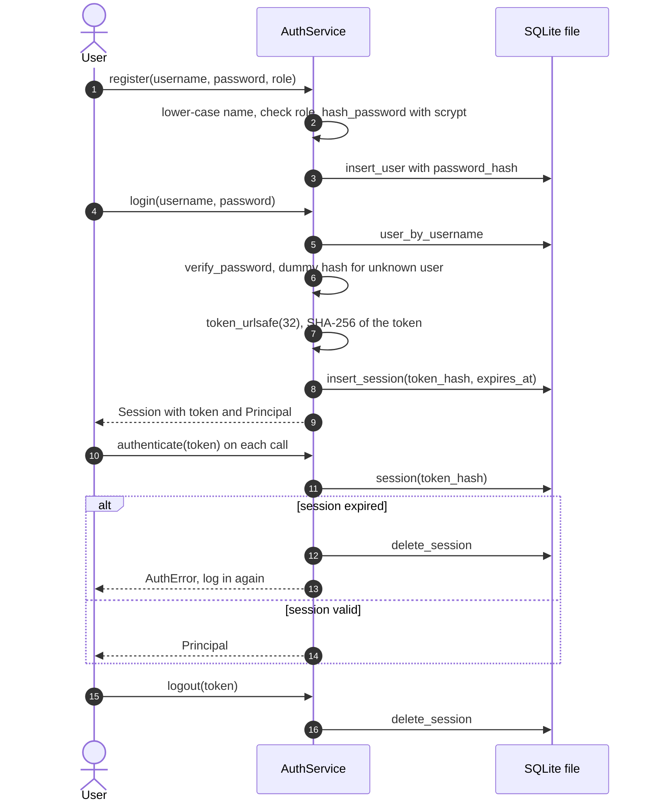
```mermaid
sequenceDiagram
    autonumber
    actor U as User
    participant AU as AuthService
    participant DB as SQLite file

    U->>AU: register(username, password, role)
    AU->>AU: lower-case name, check role, hash_password with scrypt
    AU->>DB: insert_user with password_hash
    U->>AU: login(username, password)
    AU->>DB: user_by_username
    AU->>AU: verify_password, dummy hash for unknown user
    AU->>AU: token_urlsafe(32), SHA-256 of the token
    AU->>DB: insert_session(token_hash, expires_at)
    AU-->>U: Session with token and Principal
    U->>AU: authenticate(token) on each call
    AU->>DB: session(token_hash)
    alt session expired
        AU->>DB: delete_session
        AU-->>U: AuthError, log in again
    else session valid
        AU-->>U: Principal
    end
    U->>AU: logout(token)
    AU->>DB: delete_session
```

| Input | Output |
|---|---|
| A user name and a password | A `Session` with an opaque token, the `Principal` and the expiry time |

**Procedure**

1. `register` makes the user name lower case and checks the role (`student` or `instructor`).
2. `hash_password` refuses a password with fewer than 8 characters.
3. `hash_password` stores `scrypt$N$r$p$salt$hash` with `N = 2^14`, `r = 8`, `p = 1` and a 16-byte random salt.
4. `login` verifies the password with a constant-time comparison.
5. `login` makes a random token (`secrets.token_urlsafe(32)`) and stores only its SHA-256 hash.
6. `authenticate` finds the session by the token hash and checks the expiry time.
7. If the session is expired, `authenticate` deletes it and raises `AuthError`.
8. `logout` deletes the session.

**Rules**

- An unknown user name and a wrong password give the same message: `invalid username or password`.
- For an unknown user name, `login` also verifies against a dummy hash, so both failures take the same time.
- A session lives for `STUDYBUDDY_SESSION_TTL_MINUTES` minutes (default 60).
- `require_role` raises `PermissionDenied` when the role is not correct.
- `seed_demo` makes `student_a` to `student_d` and `instructor_demo` with one shared password, 4 courses and random grades (seed 7). It does not change users that exist.

---

## 10. Progress analytics

**Purpose.** Show each student the progress of that student, and show the instructor aggregates only.

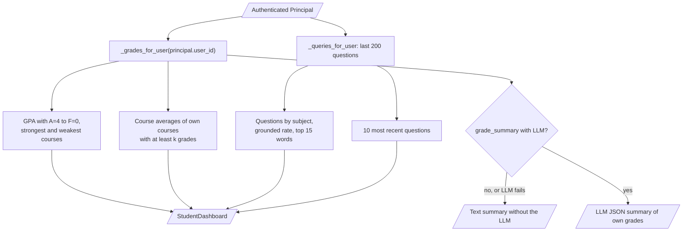
```mermaid
flowchart TD
    P[/"Authenticated Principal"/] --> G["_grades_for_user(principal.user_id)"]
    P --> H["_queries_for_user: last 200 questions"]
    G --> GPA["GPA with A=4 to F=0,<br/>strongest and weakest courses"]
    G --> AVG["Course averages of own courses<br/>with at least k grades"]
    H --> CNT["Questions by subject,<br/>grounded rate, top 15 words"]
    H --> REC["10 most recent questions"]
    GPA --> DASH[/"StudentDashboard"/]
    AVG --> DASH
    CNT --> DASH
    REC --> DASH
    G --> SUM{"grade_summary with LLM?"}
    SUM -- "no, or LLM fails" --> BASE[/"Text summary without the LLM"/]
    SUM -- "yes" --> LS[/"LLM JSON summary of own grades"/]
```

| Input | Output |
|---|---|
| The authenticated `Principal` and k | `StudentDashboard`, `InstructorOverview` or a grade summary text |

**Procedure**

1. `student_dashboard` reads the grades and the last 200 questions of the principal.
2. It calculates the grade point average (A=4, B=3, C=2, D=1, F=0), the strongest courses and the weakest courses.
3. It adds the course average only for courses of the student with at least k grades.
4. It counts the questions by subject, the grounded rate and the 15 most frequent words with more than 2 letters.
5. It keeps the 10 most recent questions.
6. `instructor_overview` checks the `instructor` role and counts grades by course and grade.
7. It hides each course with fewer than k grades, and each subject that fewer than k students asked about.
8. `grade_summary` makes a text from the grades of the caller. With an LLM, it asks for a JSON `summary`.

**Rules**

- If the LLM summary fails or is empty, `grade_summary` returns the text without the LLM.
- `purge_old_queries` deletes `query_log` rows older than `STUDYBUDDY_LOG_RETENTION_DAYS`. The value must be 1 or more.
- The dashboard name is always the display name of the authenticated principal.

---

## 11. Providers and voice input

**Purpose.** Connect the tutor to an LLM, an embedder and a speech-to-text service through small interfaces.

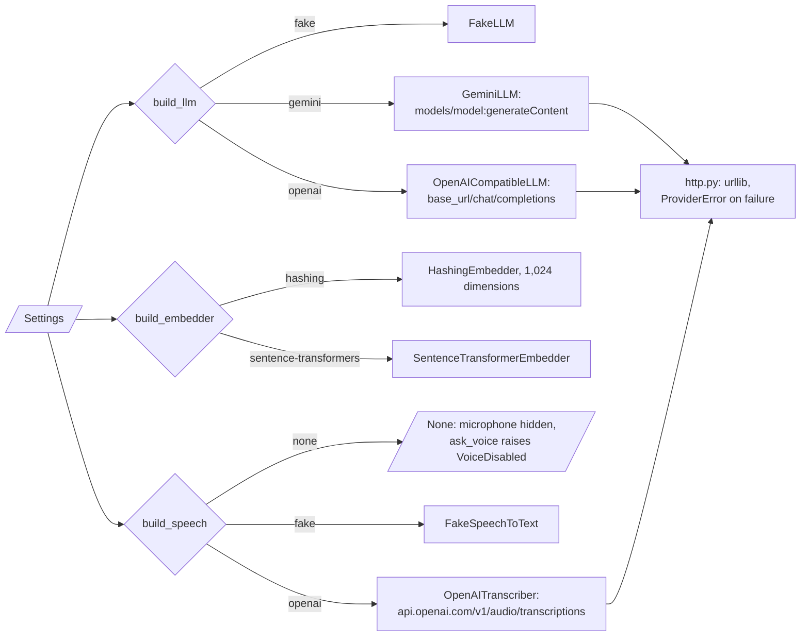
```mermaid
flowchart LR
    SET[/"Settings"/] --> BL{"build_llm"}
    BL -- "fake" --> FL["FakeLLM"]
    BL -- "gemini" --> GL["GeminiLLM:<br/>models/model:generateContent"]
    BL -- "openai" --> OL["OpenAICompatibleLLM:<br/>base_url/chat/completions"]
    SET --> BE{"build_embedder"}
    BE -- "hashing" --> HE["HashingEmbedder, 1,024 dimensions"]
    BE -- "sentence-transformers" --> STE["SentenceTransformerEmbedder"]
    SET --> BS{"build_speech"}
    BS -- "none" --> NOV[/"None: microphone hidden,<br/>ask_voice raises VoiceDisabled"/]
    BS -- "fake" --> FS["FakeSpeechToText"]
    BS -- "openai" --> OT["OpenAITranscriber:<br/>api.openai.com/v1/audio/transcriptions"]
    GL --> HTTP["http.py: urllib,<br/>ProviderError on failure"]
    OL --> HTTP
    OT --> HTTP
```

| Interface | Implementations | Selected by |
|---|---|---|
| `LLM.complete(prompt, system, json_schema)` | `FakeLLM`, `GeminiLLM`, `OpenAICompatibleLLM`, `ScriptedLLM` (tests) | `STUDYBUDDY_LLM_PROVIDER` |
| `Embedder.embed(texts)` | `HashingEmbedder` (1,024 dimensions), `SentenceTransformerEmbedder` | `STUDYBUDDY_EMBEDDING_PROVIDER` |
| `SpeechToText.transcribe(audio, mime_type)` | `FakeSpeechToText`, `OpenAITranscriber` | `STUDYBUDDY_SPEECH_PROVIDER` |

**Procedure**

1. `build_llm`, `build_embedder` and `build_speech` in `providers/factory.py` read the `Settings`.
2. `GeminiLLM` calls `models/<model>:generateContent` with temperature 0 and the header `x-goog-api-key`.
3. `OpenAICompatibleLLM` calls `<base_url>/chat/completions` with temperature 0 and a strict `json_schema` response format.
4. `OpenAITranscriber` sends the audio as multipart data to `https://api.openai.com/v1/audio/transcriptions`.
5. The UI records audio in the browser with `st.audio_input`, and `ask_voice` sends it to the speech provider.
6. The service records a voice question with `input_mode = voice`.

**Rules**

- With a JSON schema, the caller still validates the reply. The code does not trust a provider to obey the schema.
- `GEMINI_API_KEY` is necessary for `gemini`. `OPENAI_API_KEY` is necessary only when the host is `api.openai.com`.
- A local OpenAI-compatible server (for example Ollama at `http://localhost:11434/v1`) needs no key.
- `SentenceTransformerEmbedder` loads the model one time for each process.
- The HTTP helper uses only `urllib`. An HTTP error or a bad response causes `ProviderError`.
- If `STUDYBUDDY_SPEECH_PROVIDER` is `none`, the UI hides the microphone and `ask_voice` raises `VoiceDisabled`.

---

## 12. Service, CLI and user interface

**Purpose.** Give one entry point for all user actions, and two front ends on it.

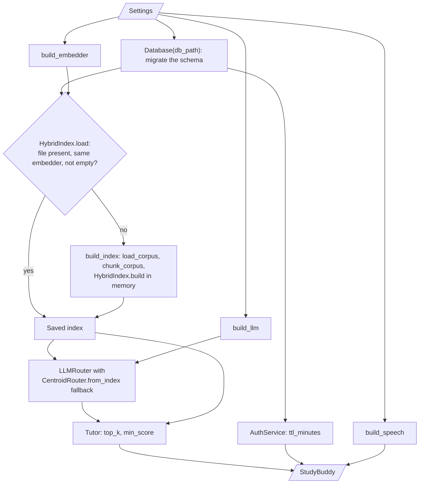
```mermaid
flowchart TD
    SET[/"Settings"/] --> DB["Database(db_path): migrate the schema"]
    SET --> EMB["build_embedder"]
    DB --> LOAD{"HybridIndex.load:<br/>file present, same embedder, not empty?"}
    EMB --> LOAD
    LOAD -- "yes" --> IDX["Saved index"]
    LOAD -- "no" --> BUILD["build_index: load_corpus, chunk_corpus,<br/>HybridIndex.build in memory"]
    BUILD --> IDX
    IDX --> RT["LLMRouter with<br/>CentroidRouter.from_index fallback"]
    SET --> LLM["build_llm"]
    LLM --> RT
    RT --> TU["Tutor: top_k, min_score"]
    IDX --> TU
    DB --> AU["AuthService: ttl_minutes"]
    SET --> SP["build_speech"]
    TU --> APP[/"StudyBuddy"/]
    AU --> APP
    SP --> APP
```

| Input | Output |
|---|---|
| `Settings` and a session token | Answers, dashboards and command output |

**Procedure**

1. `build_app` opens the database and loads the saved index from the same SQLite file.
2. If the index is absent, empty or from a different embedder, `build_app` builds it in memory from the corpus.
3. `build_app` connects the LLM, `LLMRouter` with the `CentroidRouter` fallback, the tutor, the auth service and the speech provider.
4. The CLI reads `--env-file` (default `.env`), then `Settings.from_env()`, then runs the subcommand.
5. The Streamlit UI shows the login form until the session is valid, then the pages `Chat`, `My dashboard` and `Class overview` (instructors only).

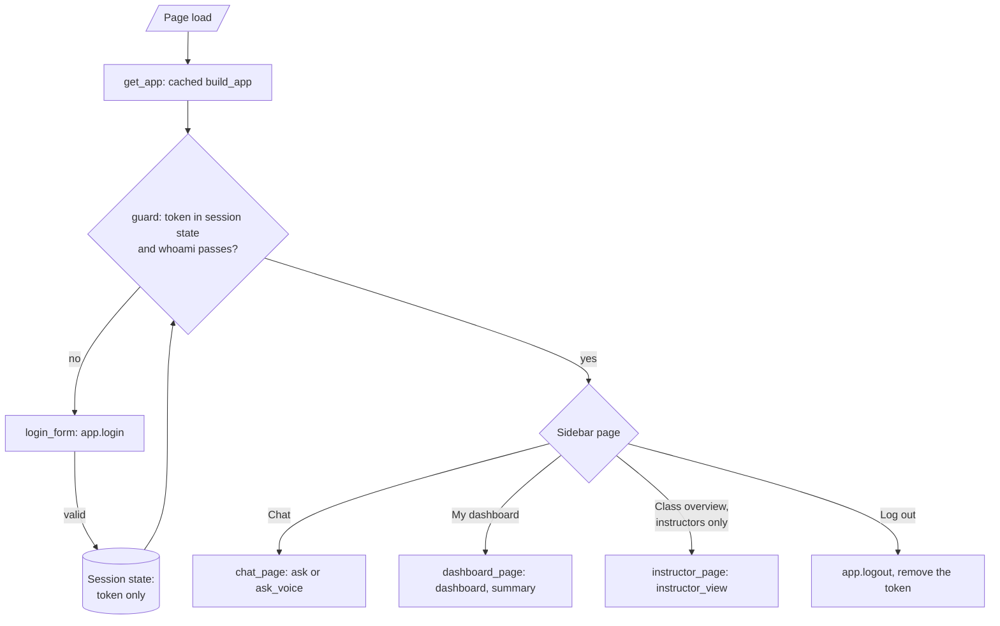
```mermaid
flowchart TD
    START[/"Page load"/] --> APP["get_app: cached build_app"]
    APP --> GUARD{"guard: token in session state<br/>and whoami passes?"}
    GUARD -- "no" --> LOGIN["login_form: app.login"]
    LOGIN -- "valid" --> TOK[("Session state:<br/>token only")]
    TOK --> GUARD
    GUARD -- "yes" --> NAV{"Sidebar page"}
    NAV -- "Chat" --> CHAT["chat_page: ask or ask_voice"]
    NAV -- "My dashboard" --> DASH["dashboard_page: dashboard, summary"]
    NAV -- "Class overview,<br/>instructors only" --> INS["instructor_page: instructor_view"]
    NAV -- "Log out" --> OUT["app.logout, remove the token"]
```

| Command | What it does |
|---|---|
| `studybuddy init [--password P]` | Make the database, the demo users and the index. Print the demo password one time |
| `studybuddy ingest` | Build the index again from the corpus and save it |
| `studybuddy ask -u USER QUESTION...` | Start a session, ask one question, end the session. The password comes from `STUDYBUDDY_PASSWORD` or a prompt |
| `studybuddy eval [--eval-set F] [--k N] [--router llm\|centroid] [--json]` | Run the evaluation harness |
| `studybuddy purge-logs` | Apply the retention policy to `query_log` |
| `studybuddy ui [-- STREAMLIT OPTIONS]` | Start the Streamlit app (needs the `ui` extra) |

**Rules**

- An error in a subcommand prints `error: <message>` on standard error, and the exit code is 1. An invalid environment variable stops the CLI before the subcommand, with a Python traceback.
- `load_dotenv` does not replace a variable that is already in the environment, and it skips empty values.
- The UI keeps only the session token in the Streamlit session state.

---

## 13. The evaluation harness

**Purpose.** Measure the router, the retrieval and the citation rate on a labelled question set.

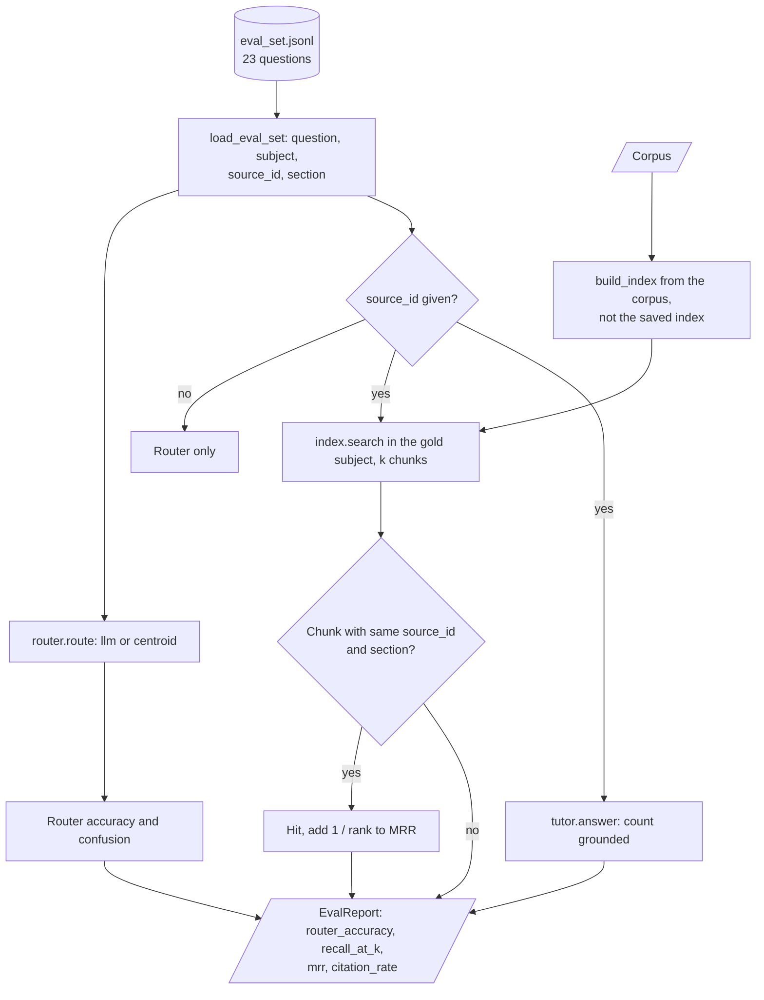
```mermaid
flowchart TD
    SET[("eval_set.jsonl<br/>23 questions")] --> LOAD["load_eval_set: question, subject,<br/>source_id, section"]
    CORP[/"Corpus"/] --> IDX["build_index from the corpus,<br/>not the saved index"]
    LOAD --> ROUTE["router.route: llm or centroid"]
    ROUTE --> ACC["Router accuracy and confusion"]
    LOAD --> SRC{"source_id given?"}
    SRC -- "no" --> SKIP["Router only"]
    SRC -- "yes" --> SEARCH["index.search in the gold subject, k chunks"]
    IDX --> SEARCH
    SEARCH --> HIT{"Chunk with same source_id<br/>and section?"}
    HIT -- "yes" --> RR["Hit, add 1 / rank to MRR"]
    SRC -- "yes" --> TUT["tutor.answer: count grounded"]
    ACC --> REP[/"EvalReport: router_accuracy, recall_at_k,<br/>mrr, citation_rate"/]
    RR --> REP
    HIT -- "no" --> REP
    TUT --> REP
```

| Input | Output |
|---|---|
| `eval_set.jsonl`: `question`, `subject`, `source_id`, `section` | `EvalReport`: `n`, `router_accuracy`, `confusion`, `recall_at_k`, `mrr`, `k`, `citation_rate` |

**Procedure**

1. `studybuddy eval` builds the index from the corpus. It does not use the saved index.
2. For each item, the router gives a subject. The harness compares it with the gold subject.
3. For each item with a `source_id`, the harness searches the gold subject with `k` chunks.
4. A hit is the first chunk with the same `source_id` and, if given, the same `section`.
5. The harness adds `1 / rank` of the hit to the MRR total.
6. With a tutor, the harness also asks each question that has a `source_id` and counts grounded answers.

**Rules**

- An empty set or a line without `question` or `subject` causes an error with the line number.
- The default `--k` is 4. The default router is `llm` (the configured LLM with the centroid fallback).

---

## 14. The safety and privacy model

The diagram shows the checks between a request and the data that it can read.

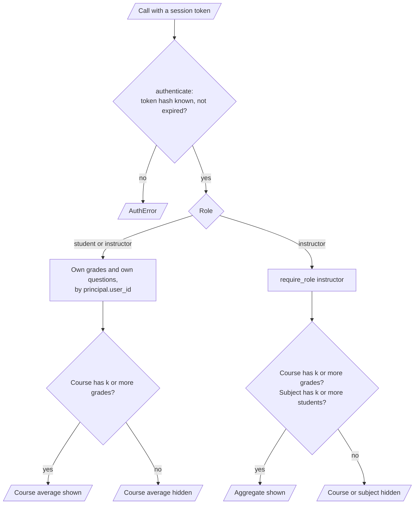
```mermaid
flowchart TD
    REQ[/"Call with a session token"/] --> AUTH{"authenticate:<br/>token hash known, not expired?"}
    AUTH -- "no" --> DENY[/"AuthError"/]
    AUTH -- "yes" --> ROLE{"Role"}
    ROLE -- "student or instructor" --> OWN["Own grades and own questions,<br/>by principal.user_id"]
    OWN --> KAV{"Course has k or more grades?"}
    KAV -- "yes" --> AVG[/"Course average shown"/]
    KAV -- "no" --> HIDE1[/"Course average hidden"/]
    ROLE -- "instructor" --> REQR["require_role instructor"]
    REQR --> KC{"Course has k or more grades?<br/>Subject has k or more students?"}
    KC -- "yes" --> AGG[/"Aggregate shown"/]
    KC -- "no" --> HIDE2[/"Course or subject hidden"/]
```

| Rule | Value | Where |
|---|---|---|
| Subject labels | `arts`, `mathematics`, `science`, `general` | `subjects.py` |
| Router retries before fallback | 1 (2 LLM calls) | `LLMRouter(retries=1)` |
| Centroid threshold for `general` | cosine `< 0.08` | `CentroidRouter.min_similarity` |
| Minimum chunk score | `0.05` | `STUDYBUDDY_MIN_SCORE` |
| Minimum score for a `general` question | `0.25` | `Tutor.general_min_score` |
| Hybrid weights | 0.6 dense, 0.4 BM25 | `HybridIndex.dense_weight` |
| Chunk size and overlap | 120 words, 1 sentence | `chunk_document` |
| Password length | 8 characters or more | `MIN_PASSWORD_LENGTH` |
| Password hash | scrypt, `N = 2^14`, `r = 8`, `p = 1`, 16-byte salt | `hash_password` |
| Session token | 32 random bytes, stored as SHA-256 | `AuthService.login` |
| Session lifetime | 60 minutes | `STUDYBUDDY_SESSION_TTL_MINUTES` |
| Minimum group for shared numbers | 3 | `STUDYBUDDY_K_ANONYMITY` |
| Query-log retention | 180 days | `STUDYBUDDY_LOG_RETENTION_DAYS` |

| Answer kind | When | What the student sees |
|---|---|---|
| `greeting` | The question matches the greeting list | A fixed greeting. Nothing is recorded |
| `grounded` | At least one valid `[n]` citation | The answer and the list of cited sources |
| `ungrounded` | No chunk, or no valid citation | The answer and the text `not grounded in the study material` |

| Role | Can see |
|---|---|
| `student` | Own grades, own questions, own dashboard, k-anonymous averages of own courses |
| `instructor` | Everything a student sees for own data, plus `Class overview` with k-anonymous aggregates only |

---

## 15. Data and file map

| Path | Committed? | Contents |
|---|---|---|
| `src/studybuddy_rag/data/corpus/*.md` | Yes | 5 sample documents written for this project (CC BY 4.0) |
| `src/studybuddy_rag/data/eval_set.jsonl` | Yes | 23 labelled questions |
| `data/studybuddy.db` | No (git ignores it) | Tables `users`, `sessions`, `courses`, `grades`, `query_log`, `schema_version`, `chunks`, `index_meta` |
| `.env` | No (git ignores it) | Local settings and API keys |
| `.env.example` | Yes | All 18 environment variables, empty |
| `*.pdf`, `*.wav`, `*.webm`, `/textbooks/`, `/index/` | No (git ignores them) | Local books and recordings |

The `query_log` table has these columns: `user_id`, `asked_at`, `input_mode` (`text` or `voice`), `question`, `subject`, `route_method`, `answer`, `citations` (JSON) and `grounded`.

The diagram shows the tables of `data/studybuddy.db`. `db.py` makes the first six tables. `HybridIndex.save` makes `chunks` and `index_meta`.

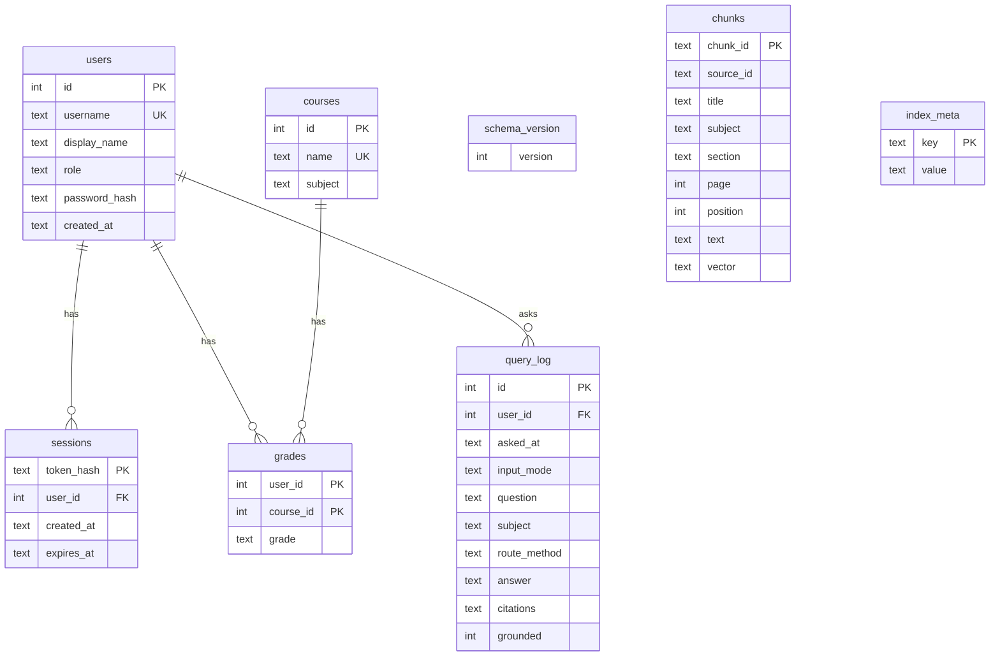
```mermaid
erDiagram
    users ||--o{ sessions : "has"
    users ||--o{ grades : "has"
    courses ||--o{ grades : "has"
    users ||--o{ query_log : "asks"
    users {
        int id PK
        text username UK
        text display_name
        text role
        text password_hash
        text created_at
    }
    sessions {
        text token_hash PK
        int user_id FK
        text created_at
        text expires_at
    }
    courses {
        int id PK
        text name UK
        text subject
    }
    grades {
        int user_id PK
        int course_id PK
        text grade
    }
    query_log {
        int id PK
        int user_id FK
        text asked_at
        text input_mode
        text question
        text subject
        text route_method
        text answer
        text citations
        int grounded
    }
    schema_version {
        int version
    }
    chunks {
        text chunk_id PK
        text source_id
        text title
        text subject
        text section
        int page
        int position
        text text
        text vector
    }
    index_meta {
        text key PK
        text value
    }
```

---

## 16. How to run studybuddy-rag

### 16.1 Prerequisites

| Need | For |
|---|---|
| Python 3.10+ | All components (CI uses 3.11) |
| `streamlit>=1.40` (extra `ui`) | The user interface |
| `sentence-transformers>=3.0` (extra `embeddings`) | Semantic vectors |
| `pymupdf>=1.24` (extra `pdf`) | The `parse_pdf` function |
| A Gemini key or an OpenAI-compatible server | A real LLM (optional) |

### 16.2 Installation

```bash
git clone https://github.com/KrishnaAnnavaram/studybuddy-rag.git
cd studybuddy-rag
python -m venv .venv
. .venv/bin/activate            # Windows: .venv\Scripts\activate
pip install -e ".[dev,ui]"
cp .env.example .env            # optional: empty values keep the offline mode
```

### 16.3 Run studybuddy-rag

Offline demo (no key, no network):

```bash
studybuddy init --password demo-pass-123        # database, 5 demo users, 22 chunks
STUDYBUDDY_PASSWORD=demo-pass-123 studybuddy ask -u student_a "How do I add 1/3 and 1/4?"
studybuddy eval                                 # router accuracy, recall@4, MRR, citation rate
studybuddy eval --router centroid --json
studybuddy purge-logs
studybuddy ui                                   # http://localhost:8501
studybuddy ui -- --server.port 8502             # Streamlit options after --
```

With a real model:

```bash
# .env
STUDYBUDDY_LLM_PROVIDER=gemini
GEMINI_API_KEY=<your key>
STUDYBUDDY_EMBEDDING_PROVIDER=sentence-transformers   # needs: pip install -e ".[embeddings]"

studybuddy ingest        # build the index again for the new embedder
```

If you change the embedder, run `studybuddy ingest`. Otherwise the app builds the index in memory at each start.

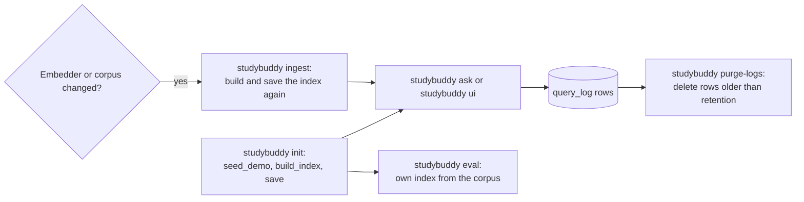
```mermaid
flowchart LR
    INIT["studybuddy init:<br/>seed_demo, build_index, save"] --> USE["studybuddy ask or studybuddy ui"]
    INIT --> EVAL["studybuddy eval:<br/>own index from the corpus"]
    CHG{"Embedder or corpus changed?"} -- "yes" --> ING["studybuddy ingest:<br/>build and save the index again"]
    ING --> USE
    USE --> LOG[("query_log rows")]
    LOG --> PURGE["studybuddy purge-logs:<br/>delete rows older than retention"]
```

### 16.4 Environment variables

| Variable | Used by | Meaning |
|---|---|---|
| `STUDYBUDDY_DB_PATH` | All | SQLite file. Default `data/studybuddy.db` |
| `STUDYBUDDY_CORPUS_DIR` | Ingestion | Folder of `.md` documents. Default: the bundled corpus |
| `STUDYBUDDY_LLM_PROVIDER` | Providers | `fake` (default), `gemini` or `openai` |
| `STUDYBUDDY_LLM_MODEL` | Providers | Model ID. Default `gemini-2.5-flash` or `gpt-4o-mini` |
| `STUDYBUDDY_LLM_BASE_URL` | Providers | LLM base URL. Default: the provider URL |
| `STUDYBUDDY_EMBEDDING_PROVIDER` | Index | `hashing` (default) or `sentence-transformers` |
| `STUDYBUDDY_EMBEDDING_MODEL` | Index | Default `all-MiniLM-L6-v2` |
| `STUDYBUDDY_SPEECH_PROVIDER` | Voice | `none` (default), `fake` or `openai` |
| `STUDYBUDDY_SPEECH_MODEL` | Voice | Default `whisper-1` |
| `STUDYBUDDY_TOP_K` | Tutor | Chunks for each question. Default 4, minimum 1 |
| `STUDYBUDDY_MIN_SCORE` | Tutor | Minimum hybrid score. Default 0.05 |
| `STUDYBUDDY_SESSION_TTL_MINUTES` | Auth | Session lifetime. Default 60, minimum 1 |
| `STUDYBUDDY_LOG_RETENTION_DAYS` | `purge-logs` | Retention of `query_log`. Default 180 |
| `STUDYBUDDY_K_ANONYMITY` | Analytics | Minimum group size. Default 3, minimum 1 |
| `STUDYBUDDY_DEMO_PASSWORD` | `init` | Demo password. Default: random, printed one time |
| `STUDYBUDDY_PASSWORD` | `ask` | Password for `ask`. If empty, the CLI asks for it |
| `GEMINI_API_KEY` | Providers | Necessary for `STUDYBUDDY_LLM_PROVIDER=gemini` |
| `OPENAI_API_KEY` | Providers, voice | Necessary for the hosted OpenAI LLM and for `openai` speech |

A value that is not a number for a number variable causes an error at start. An unknown provider name also causes an error.
Credentials are only in a local `.env` file. Git ignores this file. Do not print or commit credentials.

---

## 17. How to extend studybuddy-rag

| You want to… | Do this | Code change? |
|---|---|---|
| Use your own study material | Put `.md` files with a `title` and `subject` header in a folder. Set `STUDYBUDDY_CORPUS_DIR`. Run `studybuddy ingest` | No |
| Use a local LLM | Set `STUDYBUDDY_LLM_PROVIDER=openai` and `STUDYBUDDY_LLM_BASE_URL=http://localhost:11434/v1` | No |
| Add a subject | Add a member to `Subject` in `subjects.py`, add documents, and add questions to `eval_set.jsonl` | Small |
| Add PDF books to the corpus | Call `parse_pdf` from `load_corpus` for `*.pdf` files, with a subject for each file | Small |
| Add an LLM provider | Make a class with `name` and `complete(...)`, and add it to `build_llm` and `Settings` | Small |
| Use a local Whisper server | Add a base URL setting and pass it to `OpenAITranscriber` | Small |
| Add reranking | Rerank the result of `HybridIndex.search` in `Tutor.retrieve` | Yes |

Planned milestones (not built):

- **M5:** a cross-encoder reranker and an answer faithfulness score with an LLM judge.
- **M6:** a FastAPI back end with JWT, Alembic migrations and argon2 hashes.
- **M7:** a full open-licensed textbook set with page-level citations.

---

## 18. Validation results

| Validation | Result | Command |
|---|---|---|
| Unit tests | **55 passed** | `pytest -q` |
| Router accuracy, `llm` router with `FakeLLM` | 0.957 (22 of 23) | `studybuddy eval` |
| Router accuracy, `centroid` router | 0.870 (20 of 23) | `studybuddy eval --router centroid` |
| Retrieval recall@4 and MRR | 1.000 and 1.000 | `studybuddy eval` |
| Answers with a valid citation | 1.0 | `studybuddy eval` |
| CI | Python 3.11, `pytest -q` on each push | `.github/workflows/ci.yml` |

These numbers come from the offline fakes on the bundled 23 questions. They prove that the pipeline is connected correctly. They do not measure the answer quality of a real model.
With `FakeLLM`, the question "How do I add 1/3 and 1/4?" goes to `general`, because the fake classifier uses keywords. The `general` search still finds the correct chunk.

---

## 19. Known problems

Read these problems before you use studybuddy-rag in production.

| # | Area | Problem | Impact and action |
|---|---|---|---|
| 1 | Corpus | The bundled corpus has 5 short documents (1,319 words, 22 chunks). It is not a curriculum | Answers cover few topics. Use open-licensed books for real use |
| 2 | Ingestion | `load_corpus` reads only `*.md` files. `parse_pdf` exists but no command calls it | PDF books need a small code change. See [17](#17-how-to-extend-studybuddy-rag) |
| 3 | Citations | The check proves that a cited source exists, not that the source supports the claim | An answer can cite a source incorrectly. M5 plans a faithfulness score |
| 4 | Offline mode | `FakeLLM` routes by keywords and gives extractive answers. The `hashing` embedder is lexical | Use a real LLM and `sentence-transformers` for real quality |
| 5 | Voice | `OpenAITranscriber` always calls `api.openai.com`. No setting changes its base URL | A local Whisper server needs a small code change |
| 6 | Index | If the embedder changes, `build_app` builds the index in memory at each start, with no warning | Run `studybuddy ingest` after each change of the embedder |
| 7 | Sessions | The code deletes an expired session only when the token is used again. There is no login rate limit | Old session rows stay in the database. Add a rate limit before public use |
| 8 | Privacy | With k = 3, a student in a course with 3 grades can calculate the sum of the 2 other grades | Set `STUDYBUDDY_K_ANONYMITY` higher for small classes |
| 9 | Scale | SQLite and Streamlit share one connection in one process | Good for one server. M6 plans a FastAPI back end |
| 10 | Tuning | The weights 0.6 and 0.4, the `general` threshold 0.25 and the chunk size are constants | Change them in code. No environment variable controls them |

---

## 20. Key points

1. **The router narrows retrieval and never disables it.** A wrong subject falls back to a search of all subjects, with a note.
2. **The classifier reply is strict.** Only a JSON object with a valid label and confidence is accepted. Other replies go to the centroid fallback.
3. **Each citation must point to a real source.** The tutor removes invalid citations and marks an answer without a valid citation as `ungrounded`.
4. **Each call starts with a session check.** The service authenticates the token before it does work, also before a speech call.
5. **Each student sees only own data.** Shared numbers are k-anonymous, and the instructor sees aggregates only.
6. **The full demo runs offline.** The core has no third-party dependencies, and all 55 tests run without network or keys.

---

## 21. Glossary

| Term | Meaning |
|---|---|
| **Aggregate** | A count or an average over a group of students, shown only when the group has at least k members |
| **BM25** | A word-frequency score for a chunk against a question |
| **Centroid** | The mean vector of all chunks of one subject |
| **Chunk** | A group of whole sentences from one section, with at most 120 words |
| **Citation** | A `[n]` mark in an answer that points to source number n |
| **Corpus** | The folder of Markdown documents that contains the study material |
| **Embedder** | A provider that changes a text into a normalised vector |
| **Fake** | A deterministic offline provider for tests and the demo |
| **Grounded answer** | An answer with at least one valid citation |
| **Hybrid score** | `0.6 × dense cosine + 0.4 × normalised BM25` |
| **Index** | The chunks, their vectors and the BM25 statistics, saved in SQLite |
| **k-anonymity threshold** | The minimum group size k for a shared number |
| **Principal** | The authenticated user: ID, user name, display name and role |
| **Provider** | An LLM, an embedder or a speech-to-text service behind an interface |
| **Query log** | The `query_log` table with one row for each question that is not a greeting |
| **Route decision** | The subject, confidence, method and detail that the router gives |
| **Session** | A login with a token and an expiry time |
| **Source** | One retrieved chunk, with a number in the answer prompt |
| **Subject** | One label from `arts`, `mathematics`, `science` and `general` |
| **Ungrounded answer** | An answer with no valid citation, or with no retrieved chunk |

---

## 22. License

[MIT](LICENSE) © 2026 Krishna Annavaram
